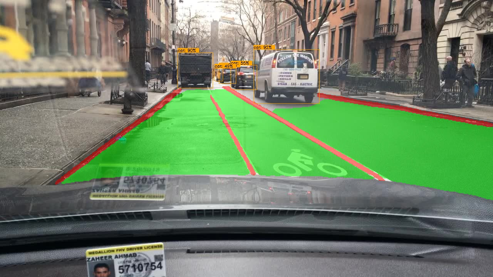
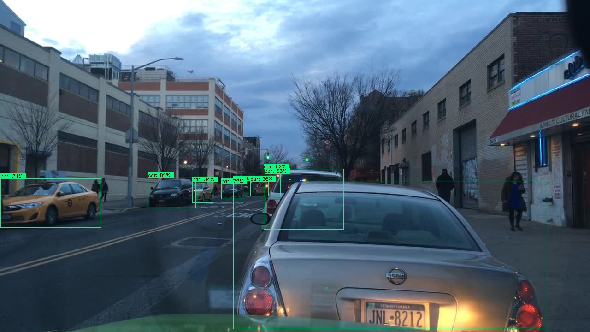
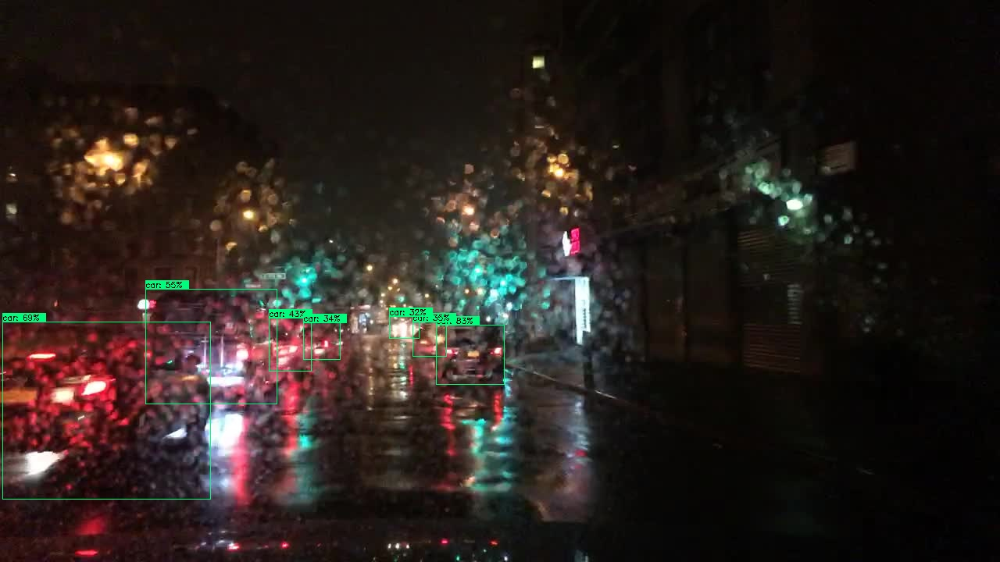
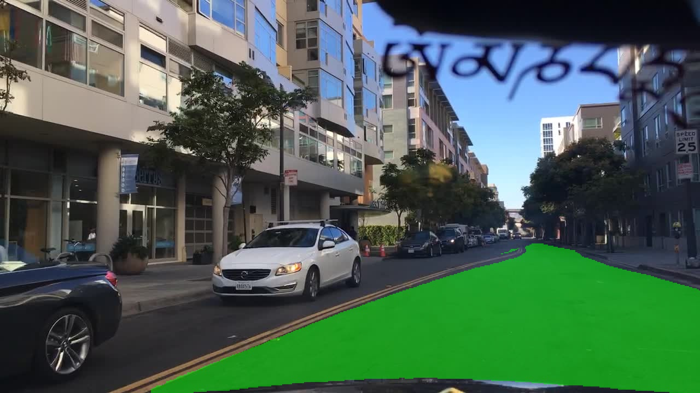
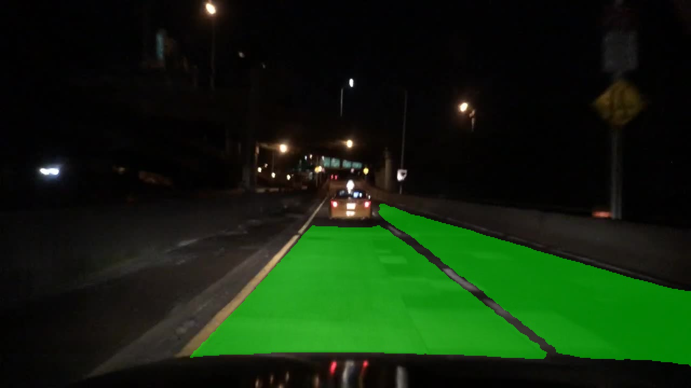
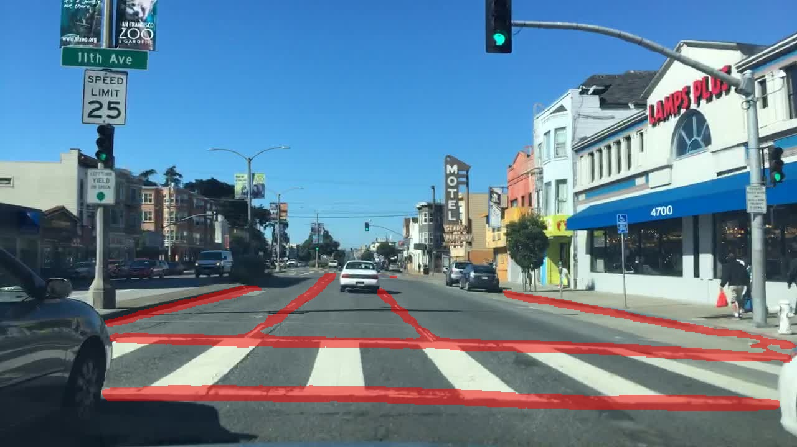
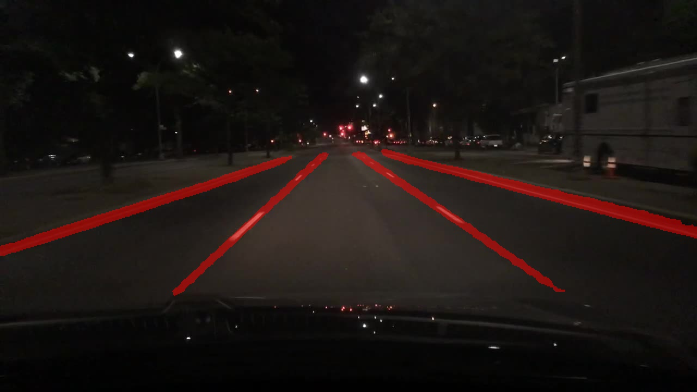

# HybridNets: End2End Perception Network


<div align="center">
 
  
**HybridNets Network Architecture.**  

[](https://github.com/datvuthanh/HybridNets/blob/main/LICENSE) 
[](https://pytorch.org/get-started/locally/) 
[](https://www.python.org/downloads/)
<br>
<!-- [![Contributors][contributors-shield]][contributors-url]
[![Forks][forks-shield]][forks-url]
[![Stargazers][stars-shield]][stars-url]
[![Issues][issues-shield]][issues-url] -->
 
</div>

> [**HybridNets: End-to-End Perception Network**](https://arxiv.org/abs/2203.09035)
>
> by Dat Vu, Bao Ngo, [Hung Phan](https://scholar.google.com/citations?user=V3paQH8AAAAJ&hl=vi&oi=ao)<sup> :email:</sup>     [*FPT University*](https://uni.fpt.edu.vn/en-US/Default.aspx)
>
>  (<sup>:email:</sup>) corresponding author.
>
> *arXiv technical report ([arXiv 2203.09035](https://arxiv.org/abs/2203.09035))*
    
[](https://paperswithcode.com/sota/traffic-object-detection-on-bdd100k?p=hybridnets-end-to-end-perception-network-1)
[](https://paperswithcode.com/sota/lane-detection-on-bdd100k?p=hybridnets-end-to-end-perception-network-1)

<!-- TABLE OF CONTENTS -->
<details>
  <summary>Table of Contents</summary>
  <ol>
    <li>
      <a href="#about-the-project">About The Project</a>
      <ul>
        <li><a href="#project-structure">Project Structure</a></li>
      </ul>
    </li>
    <li>
      <a href="#getting-started">Getting Started</a>
      <ul>
        <li><a href="#installation">Installation</a></li>
        <li><a href="#demo">Demo</a></li>
      </ul>
    </li>
    <li>
      <a href="#usage">Usage</a>
      <ul>
        <li><a href="#data-preparation">Data Preparation</a></li>
        <li><a href="#training">Training</a></li>
      </ul>
    </li>
    <li><a href="#training-tips">Training Tips</a></li>
    <li><a href="#results">Results</a></li>
    <li><a href="#license">License</a></li>
    <li><a href="#acknowledgements">Acknowledgements</a></li>
    <li><a href="#citation">Citation</a></li>
  </ol>
</details>


## About The Project
<!-- #### <div align=center> **HybridNets** = **real-time** :stopwatch: * **state-of-the-art** :1st_place_medal: * (traffic object detection + drivable area segmentation + lane line detection) :motorway: </div> -->
HybridNets is an end2end perception network for multi-tasks. Our work focused on traffic object detection, drivable area segmentation and lane detection.  HybridNets can run real-time on embedded systems, and obtains SOTA Object Detection, Lane Detection on BDD100K Dataset.
  

### Project Structure
```bash
HybridNets
│   backbone.py                   # Model configuration
│   hubconf.py                    # Pytorch Hub entrypoint
│   hybridnets_test.py            # Image inference
│   hybridnets_test_videos.py     # Video inference
│   train.py                      # Train script
│   val.py                        # Validate script
│
├───encoders                      # https://github.com/qubvel/segmentation_models.pytorch/tree/master/segmentation_models_pytorch/encoders
│       ...
│
├───hybridnets
│       autoanchor.py             # Generate new anchors by k-means
│       dataset.py                # BDD100K dataset
│       loss.py                   # Focal, tversky (dice)
│       model.py                  # Model blocks
│
├───projects
│       bdd100k.yml               # Project configuration
│
└───utils
    │   plot.py                   # Draw bounding box
    │   smp_metrics.py            # https://github.com/qubvel/segmentation_models.pytorch/blob/master/segmentation_models_pytorch/metrics/functional.py
    │   utils.py                  # Various helper functions (preprocess, postprocess, eval...)
    │
    └───sync_batchnorm            # https://github.com/vacancy/Synchronized-BatchNorm-PyTorch/tree/master/sync_batchnorm 
            ...
```

## Getting Started [](https://colab.research.google.com/drive/1Uc1ZPoPeh-lAhPQ1CloiVUsOIRAVOGWA?usp=sharing)
### Installation
The project was developed with [**Python>=3.7**](https://www.python.org/downloads/) and [**Pytorch>=1.10**](https://pytorch.org/get-started/locally/).
```bash
git clone https://github.com/datvuthanh/HybridNets
cd HybridNets
pip install -r requirements.txt
```
 
### Demo
```bash
# Download end-to-end weights
mkdir weights
curl -L -o weights/hybridnets.pth https://github.com/datvuthanh/HybridNets/releases/download/v1.0/hybridnets.pth

# Image inference
python hybridnets_test.py -w weights/hybridnets.pth --source demo/image --output demo_result --imshow False --imwrite True

# Video inference
python hybridnets_test_videos.py -w weights/hybridnets.pth --source demo/video --output demo_result

# Result is saved in a new folder called demo_result
```

## Usage
### Data Preparation
Recommended dataset structure:
```bash
HybridNets
└───datasets
    ├───imgs
    │   ├───train
    │   └───val
    ├───det_annot
    │   ├───train
    │   └───val
    ├───da_seg_annot
    │   ├───train
    │   └───val
    └───ll_seg_annot
        ├───train
        └───val
```
Update your dataset paths in `projects/your_project_name.yml`.

For BDD100K: [imgs](https://bdd-data.berkeley.edu/), [det_annot](https://drive.google.com/file/d/19CEnZzgLXNNYh1wCvUlNi8UfiBkxVRH0/view), [da_seg_annot](https://drive.google.com/file/d/1NZM-xqJJYZ3bADgLCdrFOa5Vlen3JlkZ/view), [ll_seg_annot](https://drive.google.com/file/d/1o-XpIvHJq0TVUrwlwiMGzwP1CtFsfQ6t/view)

### Training
#### 1) Edit or create a new project configuration, using bdd100k.yml as a template
```python
# mean and std of dataset in RGB order
mean: [0.485, 0.456, 0.406]
std: [0.229, 0.224, 0.225]

# bdd100k anchors
anchors_scales: '[2**0, 2**0.70, 2**1.32]'
anchors_ratios: '[(0.62, 1.58), (1.0, 1.0), (1.58, 0.62)]'

# must match your dataset's category_id.
# category_id is one_indexed,
# for example, index of 'car' here is 0, while category_id is 1
obj_list: ['car']

seg_list: ['road',
          'lane']

dataset:
  color_rgb: false
  dataroot: path/to/imgs
  labelroot: path/to/det_annot
  laneroot: path/to/ll_seg_annot
  maskroot: path/to/da_seg_annot
...
```

#### 2) Train
```bash
python train.py -p bdd100k        # your_project_name
                -c 3              # coefficient of effnet backbone, result from paper is 3
                -n 4              # num_workers
                -b 8              # batch_size per gpu
                -w path/to/weight # use 'last' to resume training from previous session
                --freeze_det      # freeze detection head, others: --freeze_backbone, --freeze_seg
                --lr 1e-5         # learning rate
                --optim adamw     # adamw | sgd
                --num_epochs 200
```
Please check `python train.py --help` for every available arguments.

#### 3) Evaluate
```bash
python val.py -p bdd100k -c 3 -w checkpoints/weight.pth
```

## Training Tips
### Anchors :anchor:
If your dataset is intrinsically different from COCO or BDD100K, or the metrics of detection after training are not as high as expected, you could try enabling autoanchor in `project.yml`:
```python
...
model:
  image_size:
  - 640
  - 384
need_autoanchor: true  # set to true to run autoanchor
pin_memory: false
...
```
This automatically finds the best combination of anchor scales and anchor ratios for your dataset. Then you can manually edit them `project.yml` and disable autoanchor.
 
If you're feeling lucky, maybe mess around with base_anchor_scale in `backbone.py`:
```python
class HybridNetsBackbone(nn.Module):
  ...
  self.pyramid_levels = [5, 5, 5, 5, 5, 5, 5, 5, 6]
  self.anchor_scale = [1.25,1.25,1.25,1.25,1.25,1.25,1.25,1.25,1.25,]
  self.aspect_ratios = kwargs.get('ratios', [(1.0, 1.0), (1.4, 0.7), (0.7, 1.4)])
  ...
```
and `model.py`:
```python
class Anchors(nn.Module):
  ...
  for scale, ratio in itertools.product(self.scales, self.ratios):
    base_anchor_size = self.anchor_scale * stride * scale
    anchor_size_x_2 = base_anchor_size * ratio[0] / 2.0
    anchor_size_y_2 = base_anchor_size * ratio[1] / 2.0
  ...
```
to get a grasp on how anchor boxes work.
 
And because a picture is worth a thousand words, you can visualize your anchor boxes in [Anchor Computation Tool](https://github.com/Cli98/anchor_computation_tool).
### Training stages
We experimented with training stages and found that this settings achieved the best results:
 
1. `--freeze_seg True` ~ 100 epochs
2. `--freeze_backbone True --freeze_det True` ~ 50 epochs
3. Train end-to-end ~ 50 epochs

 The reason being detection head is harder to converge early on, so we basically skipped segmentation head to focus on detection first.
 
## Results
### Traffic Object Detection
 
<table>
<tr><th>Result </th><th>Visualization</th></tr>
<tr><td>

|        Model       |  Recall (%)  |   mAP@0.5 (%)   |
|:------------------:|:------------:|:---------------:|
|     `MultiNet`     |     81.3     |       60.2      |
|      `DLT-Net`     |     89.4     |       68.4      |
|   `Faster R-CNN`   |     77.2     |       55.6      |
|      `YOLOv5s`     |     86.8     |       77.2      |
|       `YOLOP`      |     89.2     |       76.5      |
|  **`HybridNets`**  |   **92.8**   |     **77.3**    |

</td><td>



</td></tr> </table>
 
<!--
|        Model       |  Recall (%)  |   mAP@0.5 (%)   |
|:------------------:|:------------:|:---------------:|
|     `MultiNet`     |     81.3     |       60.2      |
|      `DLT-Net`     |     89.4     |       68.4      |
|   `Faster R-CNN`   |     77.2     |       55.6      |
|      `YOLOv5s`     |     86.8     |       77.2      |
|       `YOLOP`      |     89.2     |       76.5      |
|  **`HybridNets`**  |   **92.8**   |     **77.3**    |

<p align="middle">
 
  
</p>

-->
 
### Drivable Area Segmentation
 
<table>
<tr><th>Result </th><th>Visualization</th></tr>
<tr><td>

|       Model      | Drivable mIoU (%) |
|:----------------:|:-----------------:|
|    `MultiNet`    |        71.6       |
|     `DLT-Net`    |        71.3       |
|     `PSPNet`     |        89.6       |
|      `YOLOP`     |        91.5       |
| **`HybridNets`** |      **90.5**     |

</td><td>



</td></tr> </table>
 
<!--
|       Model      | Drivable mIoU (%) |
|:----------------:|:-----------------:|
|    `MultiNet`    |        71.6       |
|     `DLT-Net`    |        71.3       |
|     `PSPNet`     |        89.6       |
|      `YOLOP`     |        91.5       |
| **`HybridNets`** |      **90.5**     |
<p align="middle">
 
  
</p>
-->
 
### Lane Line Detection
 
<table>
<tr><th>Result </th><th>Visualization</th></tr>
<tr><td>

|      Model       | Accuracy (%) | Lane Line IoU (%) |
|:----------------:|:------------:|:-----------------:|
|      `Enet`      |     34.12    |       14.64       |
|      `SCNN`      |     35.79    |       15.84       |
|    `Enet-SAD`    |     36.56    |       16.02       |
|      `YOLOP`     |     70.5     |        26.2       |
| **`HybridNets`** |   **85.4**   |      **31.6**     |

</td><td>



</td></tr> </table>
 
<!--
|      Model       | Accuracy (%) | Lane Line IoU (%) |
|:----------------:|:------------:|:-----------------:|
|      `Enet`      |     34.12    |       14.64       |
|      `SCNN`      |     35.79    |       15.84       |
|    `Enet-SAD`    |     36.56    |       16.02       |
|      `YOLOP`     |     70.5     |        26.2       |
| **`HybridNets`** |   **85.4**   |      **31.6**     |
 
<p align="middle">
 
  
</p>
-->
<div align="center">
 
 
 
 [Original footage](https://www.youtube.com/watch?v=lx4yA1LEi9c) courtesy of [Hanoi Life](https://www.youtube.com/channel/UChT1Cpf_URepCpsdIqjsDHQ)
 
 </div>
 
## License

Distributed under the MIT License. See `LICENSE` for more information.
 
## Acknowledgements

Our work would not be complete without the wonderful work of the following authors:

* [EfficientDet](https://github.com/zylo117/Yet-Another-EfficientDet-Pytorch)
* [YOLOv5](https://github.com/ultralytics/yolov5)
* [YOLOP](https://github.com/hustvl/YOLOP)
* [KMeans Anchors Ratios](https://github.com/mnslarcher/kmeans-anchors-ratios)
* [Anchor Computation Tool](https://github.com/Cli98/anchor_computation_tool)

## Citation

If you find our paper and code useful for your research, please consider giving a star :star:   and citation :pencil: :

```BibTeX
@misc{vu2022hybridnets,
      title={HybridNets: End-to-End Perception Network}, 
      author={Dat Vu and Bao Ngo and Hung Phan},
      year={2022},
      eprint={2203.09035},
      archivePrefix={arXiv},
      primaryClass={cs.CV}
}
```
 
<!-- MARKDOWN LINKS & IMAGES -->
<!-- https://www.markdownguide.org/basic-syntax/#reference-style-links -->
[contributors-shield]: https://img.shields.io/github/contributors/othneildrew/Best-README-Template.svg?style=for-the-badge
[contributors-url]: https://github.com/datvuthanh/HybridNets/graphs/contributors
[forks-shield]: https://img.shields.io/github/forks/othneildrew/Best-README-Template.svg?style=for-the-badge
[forks-url]: https://github.com/datvuthanh/HybridNets/network/members
[stars-shield]: https://img.shields.io/github/stars/othneildrew/Best-README-Template.svg?style=for-the-badge
[stars-url]: https://github.com/datvuthanh/HybridNets/stargazers
[issues-shield]: https://img.shields.io/github/issues/othneildrew/Best-README-Template.svg?style=for-the-badge
[issues-url]: https://github.com/datvuthanh/HybridNets/issues
