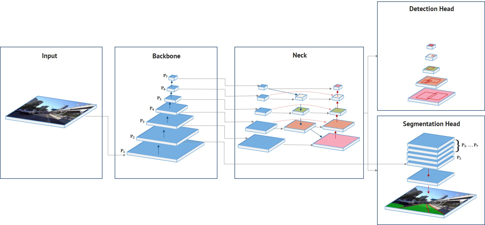

# HybridNets: End2End Perception Network


<div align="center">
 
  
**HybridNets Network Architecture.**  

[](https://github.com/datvuthanh/HybridNets/blob/main/LICENSE) 
[](https://pypi.org/search/?q=segmentation-models-pytorch) 
[](https://pepy.tech/project/segmentation-models-pytorch) 
[](https://pepy.tech/project/segmentation-models-pytorch) 

</div>

> [**You Only Look at Once for Panoptic driving Perception**](https://arxiv.org/abs/2108.11250)
>
> by Dong Wu, Manwen Liao, Weitian Zhang, [Xinggang Wang](https://xinggangw.info/)<sup> :email:</sup>     [*School of EIC, HUST*](http://eic.hust.edu.cn/English/Home.htm)
>
>  (<sup>:email:</sup>) corresponding author.
>
> *arXiv technical report ([arXiv 2108.11250](https://arxiv.org/abs/2108.11250))*
    
1) In readme we introduce all features we add 
2) Share tips for training
3) FAQs
4) Acknowledgement (EfficientDet, Yolov5, YolOP, kmeans ratio, anchor visualize cli98) 
5) We will use template yolov5 for our readme

## Project Structure
```bash
HybridNets
│   backbone.py                   # Model configuration
│   hubconf.py                    # Pytorch Hub entrypoint
│   hybridnets_test.py            # Image inference
│   hybridnets_test_videos.py     # Video inference
│   train.py                      # Train script
│   val.py                        # Validate script
│
├───encoders                      # https://github.com/qubvel/segmentation_models.pytorch/tree/master/segmentation_models_pytorch/encoders
│       ...
│
├───hybridnets
│       autoanchor.py             # Generate new anchors by k-means
│       dataset.py                # BDD100K dataset
│       loss.py                   # Focal, tversky (dice)
│       model.py                  # Model blocks
│
├───projects
│       bdd100k.yml               # Project configuration
│
└───utils
    │   smp_metrics.py            # https://github.com/qubvel/segmentation_models.pytorch/blob/master/segmentation_models_pytorch/metrics/functional.py
    │   utils.py                  # Various helper functions (preprocess, postprocess, eval...)
    │
    └───sync_batchnorm            # https://github.com/vacancy/Synchronized-BatchNorm-PyTorch/tree/master/sync_batchnorm 
            ...
```

## Installation
The project was developed with [**Python>=3.7**](https://www.python.org/downloads/) and [**Pytorch>=1.10**](https://pytorch.org/get-started/locally/).
```bash
git clone https://github.com/datvuthanh/HybridNets
cd HybridNets
pip install -r requirements.txt
```

## Data preparation
Recommended dataset structure:
```bash
HybridNets
└───datasets
    ├───imgs
    │   ├───train
    │   └───val
    ├───det_annot
    │   ├───train
    │   └───val
    ├───da_seg_annot
    │   ├───train
    │   └───val
    └───ll_seg_annot
        ├───train
        └───val
```
Update your dataset paths in `projects/your_project_name.yml`.

For BDD100K: [imgs](https://bdd-data.berkeley.edu/), [det_annot](https://drive.google.com/file/d/19CEnZzgLXNNYh1wCvUlNi8UfiBkxVRH0/view), [da_seg_annot](https://drive.google.com/file/d/1NZM-xqJJYZ3bADgLCdrFOa5Vlen3JlkZ/view), [ll_seg_annot](https://drive.google.com/file/d/1o-XpIvHJq0TVUrwlwiMGzwP1CtFsfQ6t/view)

## Demo
```bash
# Download end-to-end weights
mkdir weights
curl -o weights/hybridnets.pth https://github.com/datvuthanh/HybridNets/releases/download/v1.1/hybridnets.pth

# Image inference
python hybridnets_test.py

# Video inference
python hybridnets_test_videos.py

# Result is saved in a new folder called demo_result
```

## Training
### 1) Edit or create a new project configuration, using bdd100k.yml as a template
```python
# mean and std of dataset in RGB order
mean: [0.485, 0.456, 0.406]
std: [0.229, 0.224, 0.225]

# bdd100k anchors
anchors_scales: '[2**0, 2**0.70, 2**1.32]'
anchors_ratios: '[(0.62, 1.58), (1.0, 1.0), (1.58, 0.62)]'

# must match your dataset's category_id.
# category_id is one_indexed,
# for example, index of 'car' here is 2, while category_id of is 3
obj_list: ['car']

seg_list: ['road',
          'lane']

dataset:
  color_rgb: false
  dataroot: path/to/imgs
  labelroot: path/to/det_annot
  laneroot: path/to/ll_seg_annot
  maskroot: path/to/da_seg_annot
...
```

### 2) Train
```bash
python train.py -p bdd100k        # your_project_name
                -c 3              # coefficient of effnet backbone, result from paper is 3
                -n 4              # num_workers
                -b 8              # batch_size per gpu
                -w path/to/weight # use 'last' to resume training from previous session
                --freeze_det      # freeze detection head, others: --freeze_backbone, --freeze_seg
                --lr 1e-5         # learning rate
                --optim adamw     # adamw | sgd
                --num_epochs 200
```
Please check `python train.py --help` for all available arguments.

### 3) Evaluate
```bash
python val.py -p bdd100k -c 3 -w checkpoints/weight.pth
```
